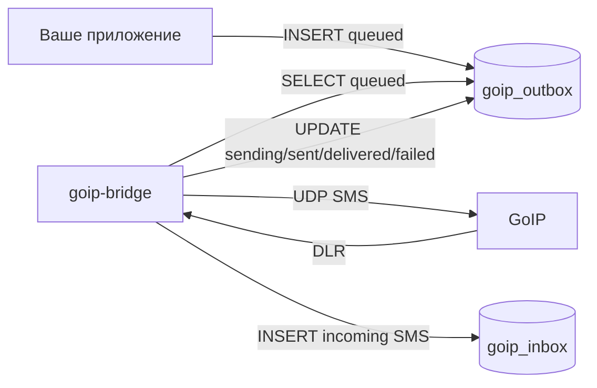

# MySQL / MariaDB для goip-bridge: база, пользователь, таблицы, очередь SMS

Этот файл можно проходить сверху вниз. Он показывает, как создать базу, пользователя, таблицы, поля и тестовые записи для `goip-bridge`.

MySQL/MariaDB режим нужен, если вы хотите работать через таблицы:

- GoIP прислал входящую SMS -> `goip-bridge` пишет строку в `goip_inbox`;
- ваше приложение хочет отправить SMS -> кладет строку в `goip_outbox`;
- `goip-bridge` забирает `queued`, отправляет через GoIP и обновляет статус.

Если база не нужна, удалите блок `db` из `config.json` и используйте HTTP API/webhook.

Схема очереди:



Больше визуальных схем: [SCHEMES.md](SCHEMES.md)

## Имена по умолчанию

В примерах используются такие имена:

```text
database:      goip_go
db user:       goip_bridge
inbox table:   goip_inbox
outbox table:  goip_outbox
host:          127.0.0.1
port:          3306
```

Именно эти имена уже стоят в закомментированном блоке `db` в [config.example.jsonc](config.example.jsonc) (его же создаёт `./goip-bridge -config config.json -init ru`).

## Быстрый вариант: залить готовую схему

В репозитории есть файл [mysql.schema.sql](mysql.schema.sql). Его можно применить так:

```sh
sudo mysql < mysql.schema.sql
```

После этого поменяйте пароль `CHANGE_ME_STRONG_DB_PASSWORD` в MySQL и в `config.json`.

Если пользователь `goip_bridge` уже существовал раньше, `CREATE USER IF NOT EXISTS` не поменяет ему пароль. Тогда выполните отдельно:

```sql
ALTER USER 'goip_bridge'@'127.0.0.1'
  IDENTIFIED BY 'CHANGE_ME_STRONG_DB_PASSWORD';
FLUSH PRIVILEGES;
```

Если хотите понять каждую команду, ниже та же схема разобрана пошагово.

## Шаг 1. Войти в MySQL или MariaDB

На Ubuntu/Debian чаще всего:

```sh
sudo mysql
```

Если root-пользователь настроен с паролем:

```sh
mysql -u root -p
```

Все SQL-команды ниже выполняются внутри MySQL/MariaDB консоли.

## Шаг 2. Создать базу

```sql
CREATE DATABASE IF NOT EXISTS goip_go
  CHARACTER SET utf8mb4
  COLLATE utf8mb4_unicode_ci;
```

Проверка:

```sql
SHOW DATABASES LIKE 'goip_go';
```

## Шаг 3. Создать пользователя для goip-bridge

Если `goip-bridge` работает на том же сервере, что и MySQL/MariaDB:

```sql
CREATE USER IF NOT EXISTS 'goip_bridge'@'127.0.0.1'
  IDENTIFIED BY 'CHANGE_ME_STRONG_DB_PASSWORD';
```

Если такой пользователь уже был, поменяйте пароль явно:

```sql
ALTER USER 'goip_bridge'@'127.0.0.1'
  IDENTIFIED BY 'CHANGE_ME_STRONG_DB_PASSWORD';
```

Если bridge подключается с другого сервера, укажите его IP вместо `127.0.0.1`:

```sql
CREATE USER IF NOT EXISTS 'goip_bridge'@'192.168.1.10'
  IDENTIFIED BY 'CHANGE_ME_STRONG_DB_PASSWORD';
```

Для простого стенда в закрытой сети иногда используют `%`, но для production лучше так не делать:

```sql
CREATE USER IF NOT EXISTS 'goip_bridge'@'%'
  IDENTIFIED BY 'CHANGE_ME_STRONG_DB_PASSWORD';
```

## Шаг 4. Выдать права

`goip-bridge` нужны только `SELECT`, `INSERT`, `UPDATE`: он читает очередь, пишет входящие и обновляет статусы.

```sql
GRANT SELECT, INSERT, UPDATE ON goip_go.* TO 'goip_bridge'@'127.0.0.1';
FLUSH PRIVILEGES;
```

Проверка прав:

```sql
SHOW GRANTS FOR 'goip_bridge'@'127.0.0.1';
```

Если вы создали пользователя с другим host, используйте тот же host в `GRANT` и `SHOW GRANTS`.

## Шаг 5. Создать таблицу входящих SMS

```sql
USE goip_go;

CREATE TABLE IF NOT EXISTS goip_inbox (
  id BIGINT UNSIGNED NOT NULL AUTO_INCREMENT,
  line VARCHAR(64) NOT NULL,
  from_number VARCHAR(64) NOT NULL,
  text TEXT NOT NULL,
  received_at DATETIME NOT NULL DEFAULT CURRENT_TIMESTAMP,
  PRIMARY KEY (id),
  KEY idx_received_at (received_at),
  KEY idx_line_received_at (line, received_at)
) ENGINE=InnoDB DEFAULT CHARSET=utf8mb4 COLLATE=utf8mb4_unicode_ci;
```

### Поля `goip_inbox`

| Поле | Тип | Кто пишет | Что значит |
|---|---:|---|---|
| `id` | `BIGINT UNSIGNED` | MySQL | Авто-ID входящего сообщения |
| `line` | `VARCHAR(64)` | bridge | Линия GoIP, например `Go1` |
| `from_number` | `VARCHAR(64)` | bridge | Номер отправителя |
| `text` | `TEXT` | bridge | Текст входящей SMS |
| `received_at` | `DATETIME` | bridge/MySQL | Время записи SMS |

Код bridge делает такой insert:

```sql
INSERT INTO goip_inbox (line, from_number, text, received_at)
VALUES (?, ?, ?, NOW());
```

## Шаг 6. Создать таблицу исходящей очереди

```sql
USE goip_go;

CREATE TABLE IF NOT EXISTS goip_outbox (
  id BIGINT UNSIGNED NOT NULL AUTO_INCREMENT,
  guid VARCHAR(64) NULL,
  line VARCHAR(64) NULL,
  type VARCHAR(8) NOT NULL DEFAULT 'sms',
  to_number VARCHAR(64) NOT NULL,
  text TEXT NULL,
  status ENUM('queued','sending','sent','delivered','done','failed','cancelled') NOT NULL DEFAULT 'queued',
  sms_no BIGINT NULL,
  error_code VARCHAR(255) NULL,
  reply TEXT NULL,
  created_at DATETIME NOT NULL DEFAULT CURRENT_TIMESTAMP,
  sent_at DATETIME NULL,
  delivered_at DATETIME NULL,
  PRIMARY KEY (id),
  KEY idx_status_id (status, id),
  KEY idx_line_status (line, status),
  KEY idx_sms_no (sms_no),
  UNIQUE KEY idx_guid (guid)
) ENGINE=InnoDB DEFAULT CHARSET=utf8mb4 COLLATE=utf8mb4_unicode_ci;
```

`type='sms'`: `to_number`=получатель, `text`=текст, результат → `sms_no`/статус `sent`→`delivered`.
`type='ussd'`: `to_number`=USSD-код (`*100#`), `text`=пусто, результат → `reply`/статус `done`.
`guid` — публичный id из `POST /sms|/ussd`, по нему работают `GET /status/{guid}` и `DELETE /message/{guid}`.
Несколько `NULL`-`guid` допустимы (легаси-строки); bridge присваивает `guid`, когда забирает такую строку в работу.

#### Обновление уже развёрнутой таблицы

```sql
ALTER TABLE goip_outbox
  ADD COLUMN guid  VARCHAR(64) NULL AFTER id,
  ADD COLUMN type  VARCHAR(8)  NOT NULL DEFAULT 'sms' AFTER line,
  ADD COLUMN reply TEXT NULL AFTER error_code,
  MODIFY status ENUM('queued','sending','sent','delivered','done','failed','cancelled') NOT NULL DEFAULT 'queued',
  ADD UNIQUE KEY idx_guid (guid);
```

⚠️ `MODIFY status` **обязателен перед запуском async-сборки**: планировщик пишет `status='sending'`, а USSD — `done`/`cancelled`; старый ENUM без этих значений такие записи отвергнет.

Если `guid` уже был добавлен раньше как обычный `KEY` (тогда строка `ADD UNIQUE KEY idx_guid` выше упадёт с `Duplicate key name`), вместо неё преобразуйте существующий индекс отдельным запросом:

```sql
ALTER TABLE goip_outbox DROP INDEX idx_guid, ADD UNIQUE KEY idx_guid (guid);
```

`UNIQUE` предполагает, что дублей непустых `guid` ещё нет — у легаси-строк `guid` всегда `NULL`, а несколько `NULL` для `UNIQUE` в MySQL разрешены.

#### Выравнивание legacy-типов к строгой схеме (необязательно)

Если таблицы достались от старого стека и типы «расслаблены» (знаковый `id`, `VARCHAR(32)`, nullable-колонки без дефолтов, `sms_no INT`, MariaDB-collation `utf8mb4_uca1400_ai_ci`), их можно привести ровно к схеме выше. На работу bridge это не влияет — он сам подаёт все значения, — но удобно, когда прод совпадает с документацией.

Сначала заполните пустые `created_at` (иначе `NOT NULL` упадёт):

```sql
UPDATE goip_outbox SET created_at = COALESCE(sent_at, NOW()) WHERE created_at IS NULL;
```

Строгие типы и ограничения `goip_outbox`:

```sql
ALTER TABLE goip_outbox
  MODIFY id BIGINT UNSIGNED NOT NULL AUTO_INCREMENT,
  MODIFY line VARCHAR(64) NULL,
  MODIFY to_number VARCHAR(64) NOT NULL,
  MODIFY sms_no BIGINT NULL,
  MODIFY created_at DATETIME NOT NULL DEFAULT CURRENT_TIMESTAMP;
```

Строгие типы и ограничения `goip_inbox`:

```sql
ALTER TABLE goip_inbox
  MODIFY id BIGINT UNSIGNED NOT NULL AUTO_INCREMENT,
  MODIFY line VARCHAR(64) NOT NULL,
  MODIFY from_number VARCHAR(64) NOT NULL,
  MODIFY text TEXT NOT NULL,
  MODIFY received_at DATETIME NOT NULL DEFAULT CURRENT_TIMESTAMP;
```

Портируемая кодировка/сортировка (`utf8mb4_unicode_ci` работает и на MySQL, и на MariaDB):

```sql
ALTER TABLE goip_outbox CONVERT TO CHARACTER SET utf8mb4 COLLATE utf8mb4_unicode_ci;
ALTER TABLE goip_inbox  CONVERT TO CHARACTER SET utf8mb4 COLLATE utf8mb4_unicode_ci;
```

### Поля `goip_outbox`

| Поле | Тип | Кто пишет | Что значит |
|---|---:|---|---|
| `id` | `BIGINT UNSIGNED` | MySQL | Авто-ID задания на отправку |
| `guid` | `VARCHAR(64) NULL` | bridge (или ваше приложение) | Публичный id для `/status` и `/message`. Можно не задавать — bridge присвоит при заборе строки |
| `line` | `VARCHAR(64) NULL` | ваше приложение / bridge | Линия GoIP. `NULL` или пусто = любая живая линия, порядок выбора не гарантирован |
| `type` | `VARCHAR(8)` | ваше приложение | `sms` (по умолчанию), `ussd` или `cmd` (управляющая команда status/reset — см. раздел ниже) |
| `to_number` | `VARCHAR(64)` | ваше приложение | Номер получателя (SMS) либо USSD-код, напр. `*100#` (USSD) |
| `text` | `TEXT NULL` | ваше приложение | Текст SMS (`NULL` для USSD) |
| `status` | `ENUM(...)` | ваше приложение / bridge | Текущий статус очереди |
| `sms_no` | `BIGINT NULL` | bridge | Номер SMS, который вернул GoIP |
| `error_code` | `VARCHAR(255)` | bridge | Ошибка отправки, если статус `failed` |
| `reply` | `TEXT NULL` | bridge | Ответ USSD при статусе `done` |
| `created_at` | `DATETIME` | MySQL | Когда задание создано |
| `sent_at` | `DATETIME NULL` | bridge | Когда GoIP принял отправку |
| `delivered_at` | `DATETIME NULL` | bridge | Когда пришел DLR или финальная ошибка |

### Статусы `goip_outbox`

| Статус | Кто ставит | Значение |
|---|---|---|
| `queued` | ваше приложение | Сообщение ждет отправки |
| `sending` | bridge | Bridge забрал строку из очереди |
| `sent` | bridge | GoIP принял SMS и вернул `sms_no` |
| `delivered` | bridge | Пришел DLR со state `0` |
| `done` | bridge | USSD выполнен, ответ лежит в `reply` |
| `failed` | bridge | Ошибка отправки, ошибка USSD или неуспешный DLR |
| `cancelled` | bridge | Сообщение отменено через `DELETE /message/{guid}`, пока оно еще было `queued` |

Формат `error_code`:

- `timeout` - GoIP не завершил отправку за `send_timeout_sec`;
- `errorstatus:N — <описание>` - устройство вернуло ошибку отправки (`+CMS ERROR` модема Quectel M35).
  Описание подставляется, если код известен, напр. `errorstatus:38 — Network out of order`; `500` обычно =
  слабый сигнал / нет баланса. Значение по-прежнему начинается с `errorstatus:N`, так что старый парсинг не ломается;
- `dlr_state:N — <описание>` - SMS отправлена, но DLR пришёл с состоянием ≠ `0` (TP-Status GSM 03.40), напр. `dlr_state:70 — SM validity period expired (permanent)`;
- `bad_number` - номер получателя не прошёл проверку (разрешены `+` и 3-20 цифр);
- `no_address` - для линии ещё не было keepalive, адрес устройства неизвестен;
- `bad_type` - в `type` не `sms`/`ussd`/`cmd`; `unknown_cmd:<X>` - неизвестная команда в `cmd`-строке;
- другие строки - подробность из UDP-протокола GoIP.

В вебхуке и в HTTP-ответе описание приходит ОТДЕЛЬНЫМ полем `error_desc` (для DLR — `state_desc`), а сырой код остаётся в `error`/`state`. Таблицы кодов — в `main.go` (`cmsErrorText`, `tpStatusText`).

Отдельные случаи, когда строка НЕ помечается `failed`:

- нет живой линии на момент отправки - строка остаётся `queued` и повторяется на следующем poll;
- bridge останавливается (`SIGTERM`) прямо во время отправки - он ждёт активные отправки до `send_timeout_sec` или `ussd_timeout_sec`. При жёстком аварийном завершении SMS может вернуться в `queued`, а USSD будет помечен `failed/interrupted` механизмом reconcile (см. ниже).

## Шаг 7. Проверить подключение пользователем bridge

Выйдите из MySQL:

```sql
exit
```

Проверьте логин:

```sh
mysql -h 127.0.0.1 -P 3306 -u goip_bridge -p goip_go
```

Внутри MySQL выполните:

```sql
SHOW TABLES;
SELECT COUNT(*) FROM goip_inbox;
SELECT COUNT(*) FROM goip_outbox;
```

Должны быть таблицы:

```text
goip_inbox
goip_outbox
```

## Шаг 8. Настроить `config.json`

Полный пример с MySQL/MariaDB:

```json
{
  "listen_udp": ":44444",
  "listen_http": "127.0.0.1:8080",
  "http_token": "CHANGE_ME_TO_LONG_RANDOM_TOKEN",
  "webhook_url": "",
  "webhook_token": "",
  "webhook_retry": { "max_hours": 3, "base_sec": 5 },
  "send_timeout_sec": 45,
  "ussd_timeout_sec": 120,
  "ussd_retransmit_sec": 60,
  "send_pacing": {
    "default": { "min_sec": 3, "max_sec": 10 },
    "per_line": {}
  },
  "default_lines": [],
  "debug": false,
  "debug_line": false,
  "log_max_mb": 10,
  "line_dead_after_sec": 120,
  "allow_src": [],
  "db": {
    "host": "127.0.0.1",
    "port": 3306,
    "user": "goip_bridge",
    "password": "CHANGE_ME_STRONG_DB_PASSWORD",
    "name": "goip_go",
    "inbox_table": "goip_inbox",
    "outbox_table": "goip_outbox",
    "poll_sec": 3
  },
  "line_passwords": {}
}
```

Перезапуск:

```sh
sudo systemctl restart goip-bridge
sudo journalctl -u goip-bridge -n 100 --no-pager
```

При успешном подключении в логе будет примерно:

```text
db: connected to goip_bridge@127.0.0.1:3306/goip_go — inbox table "goip_inbox" + outbox queue "goip_outbox" active (poll 3s)
```

Если подключение не удалось:

```text
db: configured but NOT connected (127.0.0.1:3306/goip_go): ... — retrying in background; /sms and /ussd return 503 until connected
```

В этом случае bridge будет повторять подключение к базе в фоне каждые 15 секунд. Пока база не подключена, `/sms` и `/ussd` в режиме очереди возвращают HTTP `503`, чтобы сообщение не потерялось и не ушло в обход очереди. Остальные эндпоинты, например `/lines` и `/health`, продолжают работать. Как только база снова станет доступна, в логе появится:

```text
MySQL connected (after retry)
```

Перезапускать сервис не нужно - переподключение и разбор очереди произойдут сами.

## Шаг 9. Положить SMS в очередь

Отправить через конкретную линию:

```sql
INSERT INTO goip_outbox (type, line, to_number, text, status)
VALUES ('sms', 'Go1', '996700000001', 'Test from MySQL queue', 'queued');
```

Отправить через любую живую линию:

```sql
INSERT INTO goip_outbox (type, line, to_number, text, status)
VALUES ('sms', NULL, '996700000001', 'Test from any alive line', 'queued');
```

Если `line` равен `NULL` или пустой строке, bridge выбирает линию round-robin из `default_lines`, а если `default_lines` пустой - из всех живых линий. Это удобно для простой очереди. Для production лучше записывать конкретную линию, если SIM-карты отличаются тарифом, страной, балансом или назначением.

USSD через очередь:

```sql
INSERT INTO goip_outbox (type, line, to_number, status)
VALUES ('ussd', 'Go1', '*100#', 'queued');
```

Ответ оператора появится в колонке `reply`, а финальный статус будет `done` или `failed`.

Если задан `webhook_url`, строки, добавленные в `goip_outbox` напрямую, тоже получают полный поток webhook-событий: `queued` (в момент, когда bridge забирает строку из очереди и присваивает ей `guid`), затем `sent`/`done`/`failed`. Подробнее о событиях: [API.md](API.md).

Посмотреть, что получилось:

```sql
SELECT id, line, to_number, text, status, created_at
FROM goip_outbox
ORDER BY id DESC
LIMIT 5;
```

## Шаг 10. Смотреть статусы отправки

```sql
SELECT id, line, to_number, status, sms_no, error_code, sent_at, delivered_at
FROM goip_outbox
ORDER BY id DESC
LIMIT 20;
```

Если все хорошо, статус пройдет путь:

```text
queued -> sending -> sent -> delivered
```

Иногда финальный DLR может не прийти от оператора или устройства. Тогда строка останется `sent`, но это уже значит, что GoIP принял SMS на отправку.

Для USSD нормальный путь другой:

```text
queued -> sending -> done
```

Если задание отменили до отправки через `DELETE /message/{guid}`, статус станет `cancelled`.

## Шаг 11. Смотреть входящие SMS

```sql
SELECT id, line, from_number, text, received_at
FROM goip_inbox
ORDER BY id DESC
LIMIT 20;
```

## Как bridge читает и обновляет outbox

Bridge опрашивает очередь каждые `poll_sec` секунд:

```sql
SELECT id, guid, line, type, to_number, text
FROM goip_outbox
WHERE status='queued' AND id > ?
ORDER BY id
LIMIT 100;
```

Bridge читает очередь страницами по 100 строк и может пройти дальше, если первые строки привязаны к мёртвым, занятым или ещё не готовым по pacing линиям. За один poll он запускает не больше одного задания на одну линию. Неготовая строка остаётся `queued` и будет проверена снова на следующем poll.

Потом забирает задачу:

```sql
UPDATE goip_outbox
SET status='sending', guid=?
WHERE id=? AND status='queued';
```

После отправки:

```sql
UPDATE goip_outbox
SET status='sent', sms_no=?, line=?, error_code=NULL, sent_at=NOW()
WHERE id=?;
```

После DLR:

```sql
UPDATE goip_outbox
SET status='delivered', delivered_at=NOW()
WHERE line=? AND sms_no=? AND status='sent'
  AND sent_at >= NOW() - INTERVAL 15 MINUTE
ORDER BY id DESC
LIMIT 1;
```

Если DLR неуспешный:

```sql
UPDATE goip_outbox
SET status='failed', error_code=?, delivered_at=NOW()
WHERE line=? AND sms_no=? AND status='sent'
  AND sent_at >= NOW() - INTERVAL 15 MINUTE
ORDER BY id DESC
LIMIT 1;
```

DLR может прийти почти одновременно с записью статуса `sent`. Поэтому bridge делает до 6 попыток найти подходящую строку `sent`, с паузой 1.5 секунды между попытками.

Для USSD вместо `sms_no` используется `reply`:

```sql
UPDATE goip_outbox
SET status='done', reply=?, error_code=NULL, line=?, sent_at=NOW()
WHERE id=?;
```

При ошибке USSD:

```sql
UPDATE goip_outbox
SET status='failed', error_code=?, line=?, sent_at=NOW()
WHERE id=?;
```

## Runtime-лимиты MySQL-режима

- `db.SetMaxOpenConns(8)` - максимум 8 открытых соединений к MySQL/MariaDB.
- `poll_sec` - интервал опроса `goip_outbox`, по умолчанию 3 секунды.
- `LIMIT 100` - размер одной страницы очереди; код может пройти до 20 страниц за poll, если первые страницы заняты неготовыми линиями.
- Одна линия выполняет только одно задание SMS/USSD за раз.
- После реальной попытки отправки линия ждёт `send_pacing` перед следующим заданием.
- Общий параллелизм очереди фактически ограничен числом живых и готовых линий.
- DLR retry - 6 попыток по 1.5 секунды, чтобы связать delivery report с последней строкой `sent`. Окно поиска - 15 минут: если подходящая строка `sent` не появилась за это время (например, MySQL был недоступен в момент отправки), DLR не сматчится и уйдёт в `goip-bridge.fallback.jsonl`.

## Reconcile при старте

При запуске bridge ищет строки, «застрявшие» в `sending` от прошлого аварийного завершения. SMS и USSD обрабатываются по-разному:

- SMS без `sent_at` возвращаются в `queued`, потому что отправка не была подтверждена.
- USSD в `sending` переводятся в `failed` с `error_code='interrupted'`, потому что повтор USSD может повторить платное или опасное действие.

SQL-логика для USSD:

```sql
UPDATE goip_outbox
SET status='failed', error_code='interrupted', sent_at=COALESCE(sent_at, NOW())
WHERE status='sending' AND type='ussd';
```

SQL-логика для SMS:

```sql
UPDATE goip_outbox SET status='queued'
WHERE status='sending' AND type<>'ussd' AND sent_at IS NULL;
```

Условие `sent_at IS NULL` означает «отправка не была подтверждена». Так задания, потерянные при крэше или рестарте во время отправки, не зависают навсегда. В логе это видно как `reconciled N stuck SMS 'sending' -> queued` или `reconciled N interrupted USSD 'sending' -> failed`.

## Журнал fallback.jsonl - страховка при сбое MySQL

Если MySQL недоступен, bridge несколько раз пытается записать данные, а когда попытки исчерпаны - дописывает их в файл `goip-bridge.fallback.jsonl` рядом с `config.json`. Это не молчаливая потеря, а явный журнал для ручного восстановления. Файл создаётся автоматически, только дозапись (append-only), и **не применяется к базе автоматически** - разбирайте его руками.

Права файла - `0600` (внутри номера и тексты SMS).

Каждая строка - один JSON-объект. Возможные виды:

| `kind` | Когда пишется | Поля |
|---|---|---|
| `inbox` | не удалось записать входящую SMS в `goip_inbox` | `line`, `from`, `text`, `ts` |
| `dlr` | не нашлась строка `sent` для delivery report (в т.ч. SMS старше 15 минут) | `line`, `sms_no`, `state`, `ts` |
| `db_write` | не прошёл `UPDATE`/`INSERT` по `goip_outbox` после 3 попыток | `query`, `args`, `ts` |
| `webhook_drop_full` | webhook-очередь в памяти достигла лимита 10 000 событий | `payload`, `ts` |
| `webhook_drop_expired` | webhook не доставился за `webhook_retry.max_hours` | `payload`, `attempts`, `ts` |
| `webhook_pending_shutdown` | процесс завершался, а webhook-событие ещё ждало повтора | `payload`, `attempts`, `ts` |

Если файл появился - значит, был сбой доступа к базе. Проверьте MySQL, при необходимости перенесите данные из файла в таблицы вручную, затем очистите файл.

## Полезные запросы для админа

Сколько SMS по статусам:

```sql
SELECT status, COUNT(*) AS cnt
FROM goip_outbox
GROUP BY status;
```

Последние ошибки:

```sql
SELECT id, line, to_number, error_code, sent_at, delivered_at
FROM goip_outbox
WHERE status='failed'
ORDER BY id DESC
LIMIT 20;
```

Последние входящие по линии:

```sql
SELECT id, from_number, text, received_at
FROM goip_inbox
WHERE line='Go1'
ORDER BY id DESC
LIMIT 20;
```

Очистить старые входящие старше 90 дней:

```sql
DELETE FROM goip_inbox
WHERE received_at < NOW() - INTERVAL 90 DAY;
```

Очистить старые успешные исходящие старше 90 дней:

```sql
DELETE FROM goip_outbox
WHERE status IN ('delivered', 'failed')
  AND created_at < NOW() - INTERVAL 90 DAY;
```

## Типичные проблемы

### `Access denied for user 'goip_bridge'`

Проверьте пароль, host пользователя и права:

```sql
SELECT user, host FROM mysql.user WHERE user='goip_bridge';
SHOW GRANTS FOR 'goip_bridge'@'127.0.0.1';
```

### `Unknown database 'goip_go'`

База не создана или в `config.json` другое имя:

```sql
SHOW DATABASES LIKE 'goip_go';
```

### `Table 'goip_go.goip_outbox' doesn't exist`

Таблицы не созданы или в конфиге неправильные `inbox_table` / `outbox_table`.

Проверка:

```sql
USE goip_go;
SHOW TABLES;
```

### Строки зависают в `queued`

Проверьте:

- в логе есть `MySQL connected`;
- `goip-bridge` запущен;
- `/lines` показывает живую линию;
- `poll_sec` не слишком большой;
- `to_number` и `text` заполнены.

### Строки становятся `failed`

Смотрите `error_code`:

```sql
SELECT id, status, error_code
FROM goip_outbox
WHERE status='failed'
ORDER BY id DESC
LIMIT 20;
```

Частые причины: `timeout`, ошибка пароля линии, SIM не зарегистрирована в сети, номер неверный, оператор отклонил SMS, или DLR пришел с неуспешным состоянием `dlr_state:N`.
