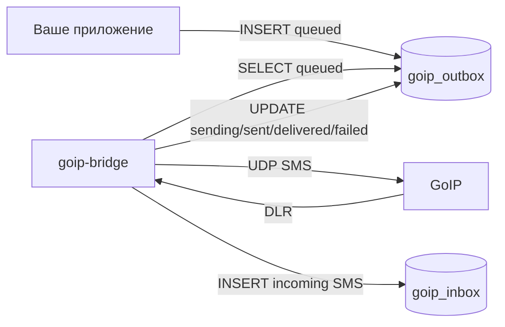

# MySQL / MariaDB для goip-bridge: база, пользователь, таблицы, очередь SMS

Этот файл можно проходить сверху вниз. Он показывает, как создать базу, пользователя, таблицы, поля и тестовые записи для `goip-bridge`.

MySQL/MariaDB режим нужен, если вы хотите работать через таблицы:

- GoIP прислал входящую SMS -> `goip-bridge` пишет строку в `goip_inbox`;
- ваше приложение хочет отправить SMS -> кладет строку в `goip_outbox`;
- `goip-bridge` забирает `queued`, отправляет через GoIP и обновляет статус.

Если база не нужна, удалите блок `db` из `config.json` и используйте HTTP API/webhook.

Схема очереди:



Больше визуальных схем: [SCHEMES.md](SCHEMES.md)

## Имена по умолчанию

В примерах используются такие имена:

```text
database:      goip_go
db user:       goip_bridge
inbox table:   goip_inbox
outbox table:  goip_outbox
host:          127.0.0.1
port:          3306
```

Именно эти имена уже стоят в [config.example.json](config.example.json).

## Быстрый вариант: залить готовую схему

В репозитории есть файл [mysql.schema.sql](mysql.schema.sql). Его можно применить так:

```sh
sudo mysql < mysql.schema.sql
```

После этого поменяйте пароль `CHANGE_ME_STRONG_DB_PASSWORD` в MySQL и в `config.json`.

Если пользователь `goip_bridge` уже существовал раньше, `CREATE USER IF NOT EXISTS` не поменяет ему пароль. Тогда выполните отдельно:

```sql
ALTER USER 'goip_bridge'@'127.0.0.1'
  IDENTIFIED BY 'CHANGE_ME_STRONG_DB_PASSWORD';
FLUSH PRIVILEGES;
```

Если хотите понять каждую команду, ниже та же схема разобрана пошагово.

## Шаг 1. Войти в MySQL или MariaDB

На Ubuntu/Debian чаще всего:

```sh
sudo mysql
```

Если root-пользователь настроен с паролем:

```sh
mysql -u root -p
```

Все SQL-команды ниже выполняются внутри MySQL/MariaDB консоли.

## Шаг 2. Создать базу

```sql
CREATE DATABASE IF NOT EXISTS goip_go
  CHARACTER SET utf8mb4
  COLLATE utf8mb4_unicode_ci;
```

Проверка:

```sql
SHOW DATABASES LIKE 'goip_go';
```

## Шаг 3. Создать пользователя для goip-bridge

Если `goip-bridge` работает на том же сервере, что и MySQL/MariaDB:

```sql
CREATE USER IF NOT EXISTS 'goip_bridge'@'127.0.0.1'
  IDENTIFIED BY 'CHANGE_ME_STRONG_DB_PASSWORD';
```

Если такой пользователь уже был, поменяйте пароль явно:

```sql
ALTER USER 'goip_bridge'@'127.0.0.1'
  IDENTIFIED BY 'CHANGE_ME_STRONG_DB_PASSWORD';
```

Если bridge подключается с другого сервера, укажите его IP вместо `127.0.0.1`:

```sql
CREATE USER IF NOT EXISTS 'goip_bridge'@'192.168.1.10'
  IDENTIFIED BY 'CHANGE_ME_STRONG_DB_PASSWORD';
```

Для простого стенда в закрытой сети иногда используют `%`, но для production лучше так не делать:

```sql
CREATE USER IF NOT EXISTS 'goip_bridge'@'%'
  IDENTIFIED BY 'CHANGE_ME_STRONG_DB_PASSWORD';
```

## Шаг 4. Выдать права

`goip-bridge` нужны только `SELECT`, `INSERT`, `UPDATE`: он читает очередь, пишет входящие и обновляет статусы.

```sql
GRANT SELECT, INSERT, UPDATE ON goip_go.* TO 'goip_bridge'@'127.0.0.1';
FLUSH PRIVILEGES;
```

Проверка прав:

```sql
SHOW GRANTS FOR 'goip_bridge'@'127.0.0.1';
```

Если вы создали пользователя с другим host, используйте тот же host в `GRANT` и `SHOW GRANTS`.

## Шаг 5. Создать таблицу входящих SMS

```sql
USE goip_go;

CREATE TABLE IF NOT EXISTS goip_inbox (
  id BIGINT UNSIGNED NOT NULL AUTO_INCREMENT,
  line VARCHAR(64) NOT NULL,
  from_number VARCHAR(64) NOT NULL,
  text TEXT NOT NULL,
  received_at DATETIME NOT NULL DEFAULT CURRENT_TIMESTAMP,
  PRIMARY KEY (id),
  KEY idx_received_at (received_at),
  KEY idx_line_received_at (line, received_at)
) ENGINE=InnoDB DEFAULT CHARSET=utf8mb4 COLLATE=utf8mb4_unicode_ci;
```

### Поля `goip_inbox`

| Поле | Тип | Кто пишет | Что значит |
|---|---:|---|---|
| `id` | `BIGINT UNSIGNED` | MySQL | Авто-ID входящего сообщения |
| `line` | `VARCHAR(64)` | bridge | Линия GoIP, например `Go1` |
| `from_number` | `VARCHAR(64)` | bridge | Номер отправителя |
| `text` | `TEXT` | bridge | Текст входящей SMS |
| `received_at` | `DATETIME` | bridge/MySQL | Время записи SMS |

Код bridge делает такой insert:

```sql
INSERT INTO goip_inbox (line, from_number, text, received_at)
VALUES (?, ?, ?, NOW());
```

## Шаг 6. Создать таблицу исходящей очереди

```sql
USE goip_go;

CREATE TABLE IF NOT EXISTS goip_outbox (
  id BIGINT UNSIGNED NOT NULL AUTO_INCREMENT,
  line VARCHAR(64) NULL,
  to_number VARCHAR(64) NOT NULL,
  text TEXT NOT NULL,
  status ENUM('queued','sending','sent','delivered','failed') NOT NULL DEFAULT 'queued',
  sms_no BIGINT NULL,
  error_code VARCHAR(255) NULL,
  created_at DATETIME NOT NULL DEFAULT CURRENT_TIMESTAMP,
  sent_at DATETIME NULL,
  delivered_at DATETIME NULL,
  PRIMARY KEY (id),
  KEY idx_status_id (status, id),
  KEY idx_line_status (line, status),
  KEY idx_sms_no (sms_no)
) ENGINE=InnoDB DEFAULT CHARSET=utf8mb4 COLLATE=utf8mb4_unicode_ci;
```

### Поля `goip_outbox`

| Поле | Тип | Кто пишет | Что значит |
|---|---:|---|---|
| `id` | `BIGINT UNSIGNED` | MySQL | Авто-ID задания на отправку |
| `line` | `VARCHAR(64) NULL` | ваше приложение / bridge | Линия GoIP. `NULL` или пусто = любая живая линия, порядок выбора не гарантирован |
| `to_number` | `VARCHAR(64)` | ваше приложение | Номер получателя |
| `text` | `TEXT` | ваше приложение | Текст SMS |
| `status` | `ENUM(...)` | ваше приложение / bridge | Текущий статус очереди |
| `sms_no` | `BIGINT NULL` | bridge | Номер SMS, который вернул GoIP |
| `error_code` | `VARCHAR(255)` | bridge | Ошибка отправки, если статус `failed` |
| `created_at` | `DATETIME` | MySQL | Когда задание создано |
| `sent_at` | `DATETIME NULL` | bridge | Когда GoIP принял отправку |
| `delivered_at` | `DATETIME NULL` | bridge | Когда пришел DLR или финальная ошибка |

### Статусы `goip_outbox`

| Статус | Кто ставит | Значение |
|---|---|---|
| `queued` | ваше приложение | Сообщение ждет отправки |
| `sending` | bridge | Bridge забрал строку из очереди |
| `sent` | bridge | GoIP принял SMS и вернул `sms_no` |
| `delivered` | bridge | Пришел DLR со state `0` |
| `failed` | bridge | Ошибка отправки или неуспешный DLR |

Формат `error_code`:

- `timeout` - GoIP не завершил отправку за `send_timeout_sec`;
- `errorstatus:N` или похожий текст от GoIP - устройство вернуло ошибку отправки;
- `dlr_state:N` - SMS была отправлена, но delivery report пришел с состоянием не `0`;
- `bad_number` - номер получателя не прошёл проверку (разрешены `+` и 3-20 цифр);
- `no_address` - для линии ещё не было keepalive, адрес устройства неизвестен;
- другие строки - подробность из UDP-протокола GoIP.

Отдельные случаи, когда строка НЕ помечается `failed`:

- нет живой линии на момент отправки - строка остаётся `queued` и повторяется на следующем poll;
- bridge останавливается (`SIGTERM`) прямо во время отправки - строка остаётся `sending` с `sent_at = NULL` и при следующем старте возвращается в `queued` механизмом reconcile (см. ниже).

## Шаг 7. Проверить подключение пользователем bridge

Выйдите из MySQL:

```sql
exit
```

Проверьте логин:

```sh
mysql -h 127.0.0.1 -P 3306 -u goip_bridge -p goip_go
```

Внутри MySQL выполните:

```sql
SHOW TABLES;
SELECT COUNT(*) FROM goip_inbox;
SELECT COUNT(*) FROM goip_outbox;
```

Должны быть таблицы:

```text
goip_inbox
goip_outbox
```

## Шаг 8. Настроить `config.json`

Полный пример с MySQL/MariaDB:

```json
{
  "listen_udp": ":44444",
  "listen_http": "127.0.0.1:8080",
  "http_token": "CHANGE_ME_TO_LONG_RANDOM_TOKEN",
  "webhook_url": "",
  "webhook_token": "",
  "send_timeout_sec": 45,
  "ussd_timeout_sec": 120,
  "ussd_retransmit_sec": 60,
  "db": {
    "host": "127.0.0.1",
    "port": 3306,
    "user": "goip_bridge",
    "password": "CHANGE_ME_STRONG_DB_PASSWORD",
    "name": "goip_go",
    "inbox_table": "goip_inbox",
    "outbox_table": "goip_outbox",
    "poll_sec": 2
  },
  "line_passwords": {}
}
```

Перезапуск:

```sh
sudo systemctl restart goip-bridge
sudo journalctl -u goip-bridge -n 100 --no-pager
```

При успешном подключении в логе будет примерно:

```text
MySQL connected: goip_bridge@127.0.0.1:3306/goip_go (inbox=goip_inbox outbox=goip_outbox)
```

Если подключение не удалось:

```text
WARNING: MySQL connect failed, retrying in background: ...
```

В этом случае HTTP API продолжит работать, а bridge будет повторять подключение к базе в фоне каждые 15 секунд. Как только база снова станет доступна, в логе появится:

```text
MySQL connected (after retry)
```

Перезапускать сервис не нужно - переподключение и разбор очереди произойдут сами.

## Шаг 9. Положить SMS в очередь

Отправить через конкретную линию:

```sql
INSERT INTO goip_outbox (line, to_number, text, status)
VALUES ('Go1', '996700000001', 'Test from MySQL queue', 'queued');
```

Отправить через любую живую линию:

```sql
INSERT INTO goip_outbox (line, to_number, text, status)
VALUES (NULL, '996700000001', 'Test from any alive line', 'queued');
```

Если `line` равен `NULL` или пустой строке, bridge выбирает одну из живых линий из Go map. Это удобно для теста, но для production-очереди лучше записывать конкретную линию, если SIM-карты отличаются тарифом, страной, балансом или назначением.

Посмотреть, что получилось:

```sql
SELECT id, line, to_number, text, status, created_at
FROM goip_outbox
ORDER BY id DESC
LIMIT 5;
```

## Шаг 10. Смотреть статусы отправки

```sql
SELECT id, line, to_number, status, sms_no, error_code, sent_at, delivered_at
FROM goip_outbox
ORDER BY id DESC
LIMIT 20;
```

Если все хорошо, статус пройдет путь:

```text
queued -> sending -> sent -> delivered
```

Иногда финальный DLR может не прийти от оператора или устройства. Тогда строка останется `sent`, но это уже значит, что GoIP принял SMS на отправку.

## Шаг 11. Смотреть входящие SMS

```sql
SELECT id, line, from_number, text, received_at
FROM goip_inbox
ORDER BY id DESC
LIMIT 20;
```

## Как bridge читает и обновляет outbox

Bridge опрашивает очередь каждые `poll_sec` секунд:

```sql
SELECT id, line, to_number, text
FROM goip_outbox
WHERE status='queued'
ORDER BY id
LIMIT 100;
```

За один poll bridge читает до 100 строк `queued`. Одновременно отправляется максимум 8 SMS по всем линиям.

Потом забирает задачу:

```sql
UPDATE goip_outbox
SET status='sending'
WHERE id=? AND status='queued';
```

После отправки:

```sql
UPDATE goip_outbox
SET status='sent', sms_no=?, line=?, error_code=NULL, sent_at=NOW()
WHERE id=?;
```

После DLR:

```sql
UPDATE goip_outbox
SET status='delivered', delivered_at=NOW()
WHERE line=? AND sms_no=? AND status='sent'
ORDER BY id DESC
LIMIT 1;
```

Если DLR неуспешный:

```sql
UPDATE goip_outbox
SET status='failed', error_code=?, delivered_at=NOW()
WHERE line=? AND sms_no=? AND status='sent'
ORDER BY id DESC
LIMIT 1;
```

DLR может прийти почти одновременно с записью статуса `sent`. Поэтому bridge делает до 6 попыток найти подходящую строку `sent`, с паузой 1.5 секунды между попытками.

## Runtime-лимиты MySQL-режима

- `db.SetMaxOpenConns(8)` - максимум 8 открытых соединений к MySQL/MariaDB.
- `poll_sec` - интервал опроса `goip_outbox`, по умолчанию 2 секунды.
- `LIMIT 100` - максимум 100 queued-строк за один poll.
- `sem := make(chan struct{}, 8)` - максимум 8 параллельных отправок SMS.
- DLR retry - 6 попыток по 1.5 секунды, чтобы связать delivery report с последней строкой `sent`. Окно поиска - 15 минут: если подходящая строка `sent` не появилась за это время (например, MySQL был недоступен в момент отправки), DLR не сматчится и уйдёт в `goip-bridge.fallback.jsonl`.

## Reconcile при старте

При запуске bridge ищет строки, «застрявшие» в `sending` от прошлого аварийного завершения, и возвращает их в очередь:

```sql
UPDATE goip_outbox SET status='queued'
WHERE status='sending' AND sent_at IS NULL;
```

Условие `sent_at IS NULL` означает «отправка не была подтверждена». Так задания, потерянные при крэше или рестарте во время отправки, не зависают навсегда. В логе это видно как `reconciled N stuck 'sending' rows -> queued`.

## Журнал fallback.jsonl - страховка при сбое MySQL

Если MySQL недоступен, bridge несколько раз пытается записать данные, а когда попытки исчерпаны - дописывает их в файл `goip-bridge.fallback.jsonl` рядом с `config.json`. Это не молчаливая потеря, а явный журнал для ручного восстановления. Файл создаётся автоматически, только дозапись (append-only), и **не применяется к базе автоматически** - разбирайте его руками.

Права файла - `0600` (внутри номера и тексты SMS).

Каждая строка - один JSON-объект. Возможные виды:

| `kind` | Когда пишется | Поля |
|---|---|---|
| `inbox` | не удалось записать входящую SMS в `goip_inbox` | `line`, `from`, `text`, `ts` |
| `dlr` | не нашлась строка `sent` для delivery report (в т.ч. SMS старше 15 минут) | `line`, `sms_no`, `state`, `ts` |
| `db_write` | не прошёл `UPDATE`/`INSERT` по `goip_outbox` | `query`, `args`, `ts` |

Если файл появился - значит, был сбой доступа к базе. Проверьте MySQL, при необходимости перенесите данные из файла в таблицы вручную, затем очистите файл.

## Полезные запросы для админа

Сколько SMS по статусам:

```sql
SELECT status, COUNT(*) AS cnt
FROM goip_outbox
GROUP BY status;
```

Последние ошибки:

```sql
SELECT id, line, to_number, error_code, sent_at, delivered_at
FROM goip_outbox
WHERE status='failed'
ORDER BY id DESC
LIMIT 20;
```

Последние входящие по линии:

```sql
SELECT id, from_number, text, received_at
FROM goip_inbox
WHERE line='Go1'
ORDER BY id DESC
LIMIT 20;
```

Очистить старые входящие старше 90 дней:

```sql
DELETE FROM goip_inbox
WHERE received_at < NOW() - INTERVAL 90 DAY;
```

Очистить старые успешные исходящие старше 90 дней:

```sql
DELETE FROM goip_outbox
WHERE status IN ('delivered', 'failed')
  AND created_at < NOW() - INTERVAL 90 DAY;
```

## Типичные проблемы

### `Access denied for user 'goip_bridge'`

Проверьте пароль, host пользователя и права:

```sql
SELECT user, host FROM mysql.user WHERE user='goip_bridge';
SHOW GRANTS FOR 'goip_bridge'@'127.0.0.1';
```

### `Unknown database 'goip_go'`

База не создана или в `config.json` другое имя:

```sql
SHOW DATABASES LIKE 'goip_go';
```

### `Table 'goip_go.goip_outbox' doesn't exist`

Таблицы не созданы или в конфиге неправильные `inbox_table` / `outbox_table`.

Проверка:

```sql
USE goip_go;
SHOW TABLES;
```

### Строки зависают в `queued`

Проверьте:

- в логе есть `MySQL connected`;
- `goip-bridge` запущен;
- `/lines` показывает живую линию;
- `poll_sec` не слишком большой;
- `to_number` и `text` заполнены.

### Строки становятся `failed`

Смотрите `error_code`:

```sql
SELECT id, status, error_code
FROM goip_outbox
WHERE status='failed'
ORDER BY id DESC
LIMIT 20;
```

Частые причины: `timeout`, ошибка пароля линии, SIM не зарегистрирована в сети, номер неверный, оператор отклонил SMS, или DLR пришел с неуспешным состоянием `dlr_state:N`.
