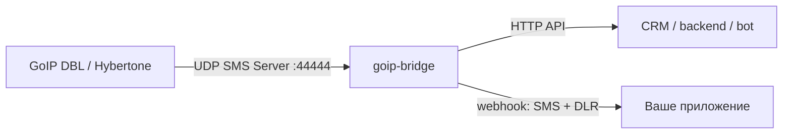

# goip-bridge - SMS и USSD API для GoIP без MySQL, Apache и goipcron

**goip-bridge** - легкий standalone-шлюз для GSM-шлюзов **GoIP DBL/Hybertone**. Он подключает железный GoIP к понятному HTTP API: принимает SMS, отправляет SMS, выполняет USSD-запросы и передает входящие события в ваш вебхук.

Если коротко: вы ставите один бинарный файл на Linux-сервер, указываете его как **SMS Server** в настройках GoIP и получаете простой API для интеграции GoIP с CRM, ботом, биллингом, мониторингом, внутренней панелью или любым backend-сервисом.

English version: [README.en.md](README.en.md)

## Скачать готовую программу

Если вы обычный пользователь и просто хотите запустить программу, **не нажимайте `Code -> Download ZIP`**. Эта кнопка скачивает исходный код, а не готовую программу.

Нужно скачать готовый релиз:

1. Откройте страницу проекта на GitHub.
2. Справа найдите блок **Releases**.
3. Нажмите **Latest** или нужную версию, например `v0.1.0`.
4. Внизу релиза откройте **Assets**.
5. Скачайте файл с названием вроде `goip-bridge`, `goip-bridge-linux-amd64` или `goip-bridge-linux-amd64.tar.gz`.
6. **Не скачивайте `Source code (zip)` и `Source code (tar.gz)`**, если вам нужна готовая программа.

Подробная инструкция для новичков: [DOWNLOAD.md](DOWNLOAD.md)

Если в разделе Releases нет готового файла `goip-bridge`, значит релиз еще не опубликован или к нему не прикрепили бинарник. В этом случае разработчик должен собрать программу из исходников или добавить готовый asset к GitHub Release.

## Что умеет goip-bridge

- Принимает регистрацию линий GoIP по UDP keepalive, по умолчанию на порту `44444`.
- Показывает активные линии через `GET /lines`.
- Принимает входящие SMS от GoIP и хранит последние 500 сообщений в памяти.
- Отправляет входящие SMS во внешний webhook.
- Отправляет SMS через HTTP-запрос `POST /sms`.
- Выполняет USSD-команды через `POST /ussd`, например запрос баланса.
- Принимает отчеты о доставке SMS, DLR, и отправляет их в webhook.
- Защищает HTTP API bearer-токеном.
- Работает без базы данных, MySQL, Apache, PHP и внешних сервисов.
- Собирается в один статический бинарный файл.

## Кому это нужно

**goip-bridge** полезен, если у вас уже есть аппаратный GSM-шлюз GoIP и нужно нормально подключить его к современному приложению:

- принимать SMS с SIM-карт в CRM, helpdesk, Telegram-бот или backend;
- отправлять сервисные и транзакционные SMS через собственный GoIP;
- проверять баланс SIM-карт через USSD;
- заменить старую связку `goipcron + MySQL + Apache/PHP`;
- сделать простой SMS gateway / SMS API поверх GoIP;
- получать входящие SMS и DLR через webhook без ручной проверки веб-интерфейса устройства.

Используйте программу только для легальных сценариев и с согласия получателей сообщений.

## Почему это проще ручного способа

Без bridge обычно приходится заходить в веб-интерфейс GoIP, разбираться со старым goipcron, поднимать базу данных и писать скрипты вокруг чужой схемы. Здесь схема проще:

`GoIP -> goip-bridge -> HTTP API / webhook -> ваше приложение`

Один конфиг, один процесс, понятные JSON-запросы.

## Скриншоты и схема

У `goip-bridge` нет графического интерфейса: это серверный сервис и HTTP API. Для GitHub-страницы полезнее показать схему работы, пример ответа API и экран настройки SMS Server в GoIP.



Рекомендуемые изображения для будущего релиза:

- `docs/screenshots/goip-sms-server-settings.png` - где в GoIP указать SMS Server IP/Port.
- `docs/screenshots/lines-api-response.png` - пример `GET /lines`.
- `docs/screenshots/inbound-sms-webhook.png` - пример входящей SMS в принимающем сервисе.

## Быстрый запуск готового релиза на Linux

Готовый релиз сейчас ориентирован на **Linux x86-64 / amd64**.

1. Скачайте бинарник из **GitHub Releases**, не из `Code -> Download ZIP`.
2. Положите рядом файл `config.json`. Пример есть в [config.example.json](config.example.json).
3. Отредактируйте токен и адреса:

```json
{
  "listen_udp": ":44444",
  "listen_http": "127.0.0.1:8080",
  "http_token": "CHANGE_ME",
  "webhook_url": "",
  "webhook_token": "",
  "send_timeout_sec": 45,
  "ussd_timeout_sec": 60,
  "retransmit_sec": 5,
  "line_passwords": {}
}
```

4. Дайте файлу право на запуск и стартуйте сервис:

```sh
chmod +x goip-bridge
./goip-bridge -config config.json
```

5. В веб-интерфейсе GoIP откройте настройки SMS нужного канала и укажите:

```text
SMS Server IP: IP-адрес сервера, где запущен goip-bridge
SMS Server Port: 44444
Client ID / Password: как настроено на линии GoIP
```

6. Проверьте, что линия появилась:

```sh
curl -H "Authorization: Bearer CHANGE_ME" http://127.0.0.1:8080/lines
```

Более подробная установка и диагностика: [INSTALL.md](INSTALL.md)

## HTTP API

Все запросы используют JSON. Если в `config.json` задан `http_token`, добавляйте заголовок:

```text
Authorization: Bearer CHANGE_ME
```

### Список линий

```sh
curl -H "Authorization: Bearer CHANGE_ME" http://127.0.0.1:8080/lines
```

### Отправить SMS

```sh
curl -X POST http://127.0.0.1:8080/sms \
  -H "Authorization: Bearer CHANGE_ME" \
  -H "Content-Type: application/json" \
  -d '{"line":"Go1","to":"996700000001","text":"Test message"}'
```

Если `line` оставить пустой, bridge выберет первую живую линию.

### Выполнить USSD

```sh
curl -X POST http://127.0.0.1:8080/ussd \
  -H "Authorization: Bearer CHANGE_ME" \
  -H "Content-Type: application/json" \
  -d '{"line":"Go1","code":"*100#"}'
```

### Получить последние входящие SMS

```sh
curl -H "Authorization: Bearer CHANGE_ME" http://127.0.0.1:8080/inbox
```

## Webhook для входящих SMS и DLR

Если в `config.json` задан `webhook_url`, bridge отправляет туда `POST` с JSON.

Входящая SMS:

```json
{
  "type": "sms",
  "line": "Go1",
  "from": "+996555111222",
  "text": "Message text",
  "time": "2026-06-09T18:00:00Z"
}
```

Отчет о доставке:

```json
{
  "type": "dlr",
  "line": "Go1",
  "sms_no": "123",
  "state": "DELIVRD",
  "time": "2026-06-09T18:00:00Z"
}
```

## Для разработчиков

Нужен Go 1.21 или новее.

```sh
git clone https://github.com/e-u-shapovalov/goip-bridge.git
cd goip-bridge
cp config.example.json config.json
go run . -config config.json
```

Сборка статического бинарника для Linux:

```sh
CGO_ENABLED=0 GOOS=linux GOARCH=amd64 go build -o goip-bridge .
```

## Ограничения

- Нужен аппаратный GoIP/DBL/Hybertone, который поддерживает UDP-протокол **SMS Server**.
- `goip-bridge` не является SMPP-сервером. Он дает HTTP API и webhook поверх GoIP.
- Встроенный `/inbox` хранит последние 500 входящих SMS в памяти. После перезапуска история очищается.
- Длинные SMS режет и собирает само устройство GoIP. Bridge работает с уже готовым текстом сообщения.
- Версия `0.1.0` - ранний релиз. Перед рабочим использованием проверьте поведение на своей модели GoIP и своей сети.

## FAQ

### Мне нужен Git?

Нет, если вы скачиваете готовый релиз. Git нужен только разработчикам, которые хотят менять код или собирать программу сами.

### Что скачивать на GitHub?

Скачивайте файл из **Releases -> Assets**. Для обычного пользователя правильный файл содержит `goip-bridge` и часто `linux-amd64` в названии. Не скачивайте `Source code`.

### Почему `Code -> Download ZIP` не подходит?

Потому что это архив исходного кода. Внутри нет готовой установленной программы. Такой архив нужен разработчикам.

### Можно ли запустить на Windows?

Код Go технически переносимый, но готовый релиз в проекте описан как Linux x86-64. Для обычной установки используйте Linux-сервер, VPS или мини-ПК в сети с GoIP.

### Как узнать имя линии?

Запустите bridge, настройте GoIP на отправку keepalive в `listen_udp`, затем откройте:

```sh
curl -H "Authorization: Bearer CHANGE_ME" http://127.0.0.1:8080/lines
```

В ответе будет поле `id`, например `Go1`.

### Нужна ли база данных?

Нет. Программа специально сделана без MySQL и других внешних зависимостей.

## Диагностика

### `/lines` возвращает пустой список

Проверьте, что в GoIP указан правильный `SMS Server IP` и порт `44444`, сервер доступен по UDP, firewall не блокирует порт, а GoIP и сервер видят друг друга по сети.

### Ответ `unauthorized`

Токен в заголовке не совпадает с `http_token` в `config.json`. Проверьте формат:

```text
Authorization: Bearer CHANGE_ME
```

### Ответ `no alive line`

Bridge не видит живую линию. Обычно это значит, что GoIP еще не прислал keepalive, линия не в статусе `LOGIN` или указан неправильный `line`.

### USSD уходит в timeout

Проверьте GSM-сеть, баланс SIM-карты, доступность USSD-кода у оператора и параметр `ussd_timeout_sec`.

### Webhook не получает события

Проверьте `webhook_url`, доступность URL с сервера, HTTPS-сертификат, firewall и `webhook_token`, если приемник требует авторизацию.

## SEO: как это ищут

Проект закрывает задачи, которые часто ищут как **GoIP SMS API**, **GoIP SMS gateway**, **GoIP webhook incoming SMS**, **GoIP USSD API**, **отправка SMS через GoIP**, **прием SMS с GoIP**, **HTTP API для GSM шлюза**, **замена goipcron**, **GoIP без MySQL**, **GSM modem SMS gateway**.

Текст написан без спама: поисковикам важны первые абзацы, понятные заголовки, реальные сценарии использования и совпадение терминов с тем, как пользователи описывают проблему.

## Статус релиза

Этот коммит меняет только документацию. Версия релиза не меняется. Перед продвижением проекта проверьте страницу **Releases** и убедитесь, что к текущему релизу прикреплен готовый asset для Linux x86-64.

## Лицензия и связь

Лицензия в локальной копии репозитория не найдена. Перед публичным использованием желательно добавить `LICENSE`, например MIT или Apache-2.0, если это соответствует вашим планам.

Автор указан в module path: `github.com/e-u-shapovalov/goip-bridge`. Для вопросов, багов и предложений лучше использовать GitHub Issues.
